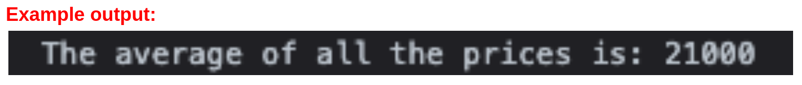
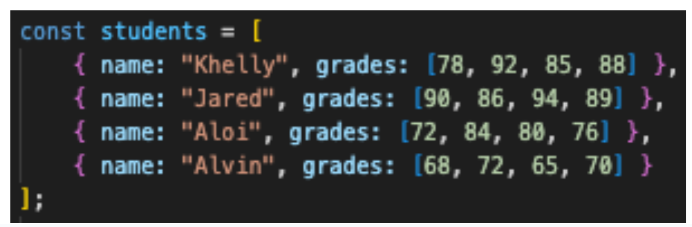

Technical Assessment 3

Student’s Full Name: Helen Laganzo

Batch Number: WD84P

GOAL

- Lesson Recap: Cite more examples for each topic discussed.
- Practice for Technical Assessment after your boot camp.

Instructions

- Each question contains different instructions to execute the desired output. Please ensure that all instructions are followed to prepare for your future company's protocol adherence.

`CLUE: Utilize your available resources such as lectures, exercises, internet resources (Google or other search engines), or reference books that you have.`

- Once this link has been accessed, duplicate this document to your own Google Drive and share this link in your canvas assignment under Technical Assessment 3. Your hard work is highly appreciated
	
`How to duplicate this document? Go to File > Make a  Copy`

- We do not depend on scores for this assessment, your output will depend on our feedback that will be used for consultation time.

Coding Exam

Object Constructors and Array Methods 
`(Use ES6 approach especially when writing functions and loops)`

Coding Exercise 1

Instructions:
1. Create an object for a Car with the following properties:
    Brand
    Model
    Year
    Color
    Mileage
    Price
2. Create three Car objects and assign values to their properties.
3. Write a function that takes an array of Car objects as a argument/parameter and returns the average price of all the cars in the array.

Coding Exercise 2

Instructions:
1. Create an object for a Book with the following properties:
    Title
    Author
    Pages
    Year
    Genre
2. Create three Book objects and assign values to their properties.
3. Write a function that takes an array of Book objects as a argument/parameter and returns an array of book titles that belong to a specific genre. ()

`Example filter function with argument, in this case “Fiction”.`

`Example output: (in this case, assume that this book titles have the same genre.)`

Instructions:
1. Write a function that takes the shopping cart array as a argument/parameter and returns the total cost of all the items in the cart.

2. Write a function that takes the shopping cart array as a argument/parameter and returns an array of all items that has more than five stocks and its price is greater than or equal to 20.

3. Write a function that takes the shopping cart array as a parameter and returns an array of all the items whose price is greater than the supplied amount (specified as a parameter to the function).

`Example output: (assume that this is the function call "getItemsAbovePrice(cart, 15)")`

Coding Exercise 4

Given:

Note: The grades property is in array form and you need to iterate inside to manipulate the values.

Write a function that takes this array as a parameter and returns an array of objects representing the average grade for each student. Each object in the returned array should have the following properties:

- name (string)
- averageGrade (number, rounded to two decimal places)

`Example output:`

